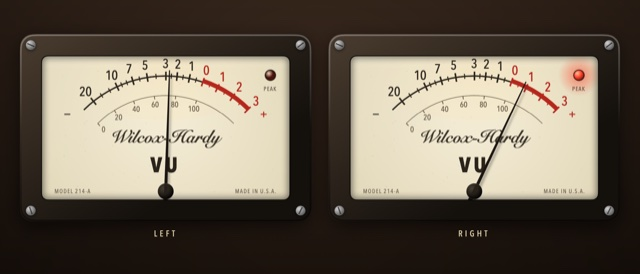
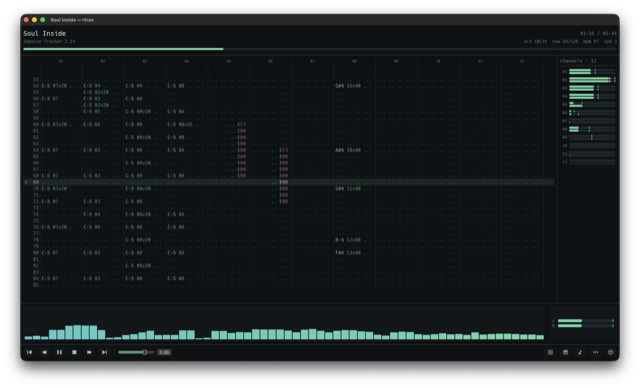
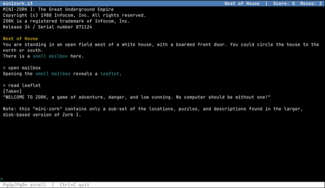
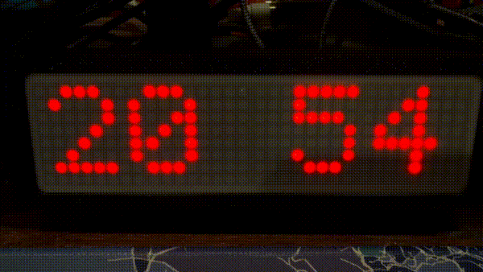
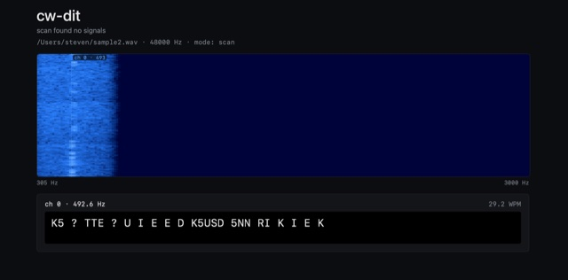
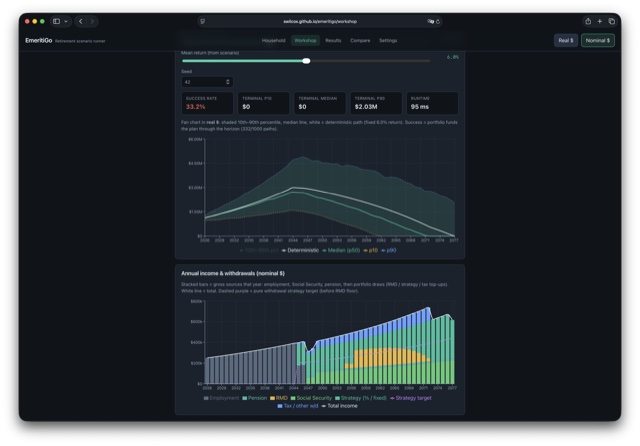
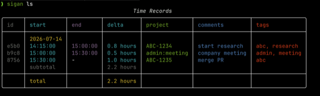
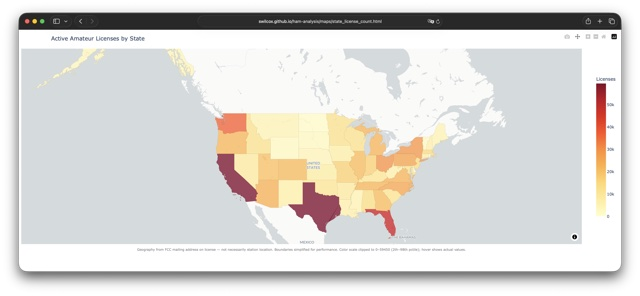
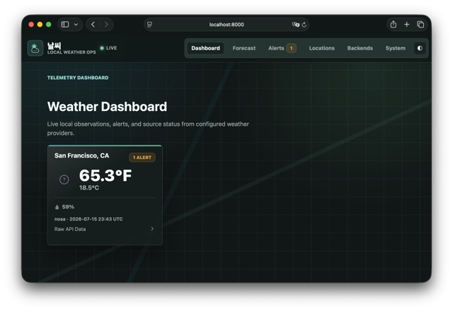

## Howdy!

## Selected projects

<table>
  <tr>
    <td align="center" valign="top" width="33%">
       
      <b><a href="https://github.com/swilcox/wilcox-hardy-vu">Wilcox-Hardy VU</a></b> 
      Photorealistic macOS VU meters for any audio input
    </td>
    <td align="center" valign="top" width="33%">
       
      <b><a href="https://github.com/swilcox/rtrax">rtrax</a></b> 
      TUI + GUI MOD/XM/IT player in Rust
    </td>
    <td align="center" valign="top" width="33%">
       
      <b><a href="https://github.com/swilcox/zgigye">zgigye</a></b> 
      Z-machine in Zig — <a href="https://swilcox.github.io/zgigye/">play in the browser</a>
    </td>
  </tr>
  <tr>
    <td align="center" valign="top" width="33%">
       
      <b><a href="https://github.com/swilcox/led-kurokku-esp">Kurokku</a></b> 
      Networked LED/LCD clocks — Pi, ESP32, and server 
      
        <a href="https://github.com/swilcox/led-kurokku">led</a> ·
        <a href="https://github.com/swilcox/lcd-kurokku">lcd</a> ·
        <a href="https://github.com/swilcox/led-kurokku-go">go</a> ·
        <a href="https://github.com/swilcox/led-kurokku-esp">esp</a> ·
        <a href="https://github.com/swilcox/kurokku-esp-server">server</a>
      
    </td>
    <td align="center" valign="top" width="33%">
       
      <b><a href="https://github.com/swilcox/cw-dit">cw-dit</a></b> 
      Multi-channel CW/Morse decoder with waterfall UI
    </td>
    <td align="center" valign="top" width="33%">
       
      <b><a href="https://github.com/swilcox/emeritigo">emeritigo</a></b> 
      US retirement scenario runner (static web app)
    </td>
  </tr>
  <tr>
    <td align="center" valign="top" width="33%">
       
      <b><a href="https://github.com/swilcox/sigan">sigan</a></b> 
      Time tracking CLI in Rust (successor to <a href="https://github.com/swilcox/sigye">sigye</a>)
    </td>
    <td align="center" valign="top" width="33%">
       
      <b><a href="https://github.com/swilcox/ham-analysis">ham-analysis</a></b> 
      Geographic analysis of US amateur radio licenses
    </td>
    <td align="center" valign="top" width="33%">
       
      <b><a href="https://github.com/swilcox/nalssi">nalssi</a></b> 
      Centralized weather data collection and distribution
    </td>
  </tr>
</table>
